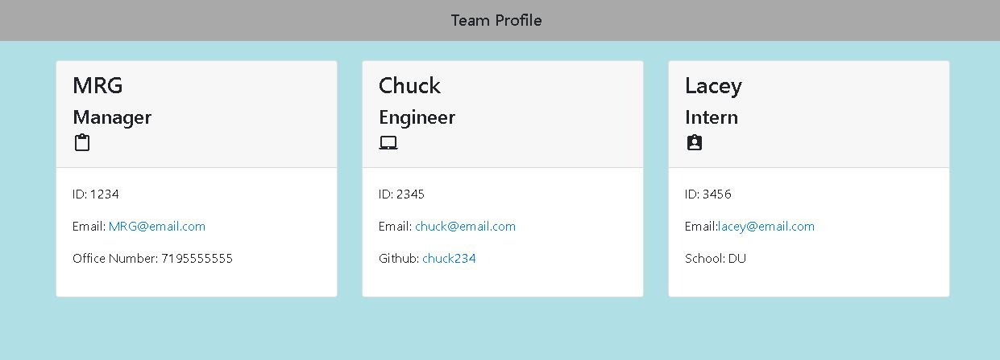

# MrG-Team-Generator
Collect employee data and generate an HTML

## Description
The challenge was to create a team generator using object oriented programming and run some tests using Jest

## Installation
This required Jest, Inquire8.2.4, and Node Js

## Screenshot
